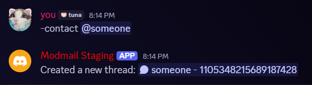

# ModMail Staff Guide

Welcome to ModMail! This guide will walk you through the typical workflow of
handling user threads, from when a thread first appears to closing threads.

> [!NOTE]
> This guide will use commands like `-command`. You can also change the prefix
> to something else with the `-settings` command so if you have a different
> prefix, just replace `-` with your chosen prefix in the examples below.

## When a New Thread Appears

When a user sends a DM to the bot, you'll see a new thread pop up in the forum
channel. Each thread comes loaded with helpful context about the user - their
account creation date, when they joined the server, their current roles, and
which mutual servers they share with the bot.

You can also manually create a thread for a user by using the `-contact`
command. Use `-contact @user` or `-contact [user_id]` to start a new
conversation with someone. This is useful for reaching out proactively or
following up on issues without needing the user to DM the bot first.

> [!TIP]
> Want to make sure all staff members are automatically added to new threads?
> Add a notification role in the `-settings` command, with the notifications set
> to `silent` if desired.

## Replying to Users

You have several ways to reply to a recipient:

**When you want to stay anonymous**, use `-areply` (or `-ar`). This hides your
username from the user and only shows the server name.

**Regular Replies**, just use `-reply` (or `-r` for short). This shows your
username to the user, so they know who they're talking to.

**For special cases** like Discord invites that need to work properly, use
`-preply` (or `-pr`) for plain text replies. This does not use any embed
formatting so things like invite links actually function.
There's also `-apreply` (or `-apr`) if you want anonymous plain text.

Made a typo or need to clarify something? No problem! Reply to the message you
want to edit with `-edit [new content]` (or just `e`).

If you need to remove a message entirely, reply with `delete` (or `d`).

> [!TIP]
> Any staff member can edit or delete messages in the thread.

## Using Snippets for Common Responses

Tired of typing the same responses over and over? Snippets are your friend!

Create commonly used responses with `-snippet add [name] [content]`. For example,
you might create a "server-rules" snippet with a link to your rules channel, or
a "ban-appeal" snippet explaining your appeal process.

When you need to use a snippet, just type `-snippetname` and the bot will send
that content. For example, `-server-rules` would send the content of the
"server-rules" snippet.

Use `-snippet list` to see all available snippets, or `snippet edit
[name] [new content]` to update existing ones. Clean up old snippets with
`-snippet delete [name]`.

## Organizing Your Conversation

You can optionally rename threads to reflect what the issue is actually about.
Instead of just threads with the default username and ID, you could rename it to
something like "Ban Appeal - User#1234" or "Question about xyz - User#1234".

Feel free to add forum tags to categorize the conversation - maybe "Appeal",
"Question", "Bug Report", etc. Just make sure you don't remove the **Open** and
**Closed** tags that the bot manages automatically.

## Interactive Notifications

The bot relays reactions between you and the user. React to messages in the
staff thread and those reactions will appear in the user's DM (as long as the
bot has access to those emojis). The user's reactions to their own messages will
also show up in your thread.

If users join or leave servers while you're talking, you'll see notifications
pop up in the thread.

## Wrapping Up Threads

When you've resolved the user's issue or the conversation has naturally
concluded, use the `-close` command to close and archive it. The bot **won't**
send a DM to the user when you close since closing a thread is only for staff
reference.

Closed threads will always stay in Discord as closed threads, so you can always
refer back to them without any risk of losing information due to bot downtime
or if you decide to use a different bot in the future.

## Tips

- The bot will re-upload images and files sent by users, so you can always
  access them later in the thread without risk of losing them if the user
  decides to delete their original message.
- You can discuss internally in threads before replying to users - anything
  without a command prefix stays between staff.
- Use the `-help` command anytime to see all available commands

## Troubleshooting
- If features aren't working, check that the bot has the right permissions in
  both the forum channel
- If there's any failures with relaying messages, an errors log thread will be
  created in the forum channel with details about what went wrong. If it's
  unclear, feel free to ask for help in the
  [support server](https://discord.gg/Bz5Q2WfuE7).
