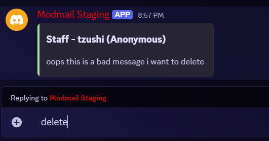

# ModMail Staff Guide <!-- omit from toc -->

Welcome to ModMail! This guide will walk you through the typical workflow of
handling user threads, from when a thread first appears to closing threads.

## Table of Contents <!-- omit from toc -->
- [Quick Start](#quick-start)
- [When a New Thread Appears](#when-a-new-thread-appears)
- [Replying to Users](#replying-to-users)
  - [Anonymous Replies](#anonymous-replies)
  - [Regular Replies](#regular-replies)
  - [Plain Text Replies](#plain-text-replies)
- [Editing and Deleting Messages](#editing-and-deleting-messages)
- [Using Snippets for Common Responses](#using-snippets-for-common-responses)
  - [Creating Snippets](#creating-snippets)
  - [Using Snippets](#using-snippets)
  - [Managing Snippets](#managing-snippets)
- [Organizing Your Conversation](#organizing-your-conversation)
- [Interactive Notifications](#interactive-notifications)
- [Wrapping Up Threads](#wrapping-up-threads)
- [Tips](#tips)
- [Troubleshooting](#troubleshooting)
  - [Common Issues](#common-issues)
  - [Error Logs](#error-logs)
  - [Getting Help](#getting-help)

> [!NOTE]
> This guide uses commands like `-command`. You can change the prefix with the 
> `-settings` command. If you have a different prefix, replace `-` with your 
> chosen prefix in the examples below.

## Quick Start

**New to ModMail?** Here's what you need to know to get started:

1. **New threads appear automatically** when users DM the bot
2. **Reply with `-reply`** (or `-r`) to respond with your username visible
3. **Reply with `-areply`** (or `-ar`) to respond anonymously
4. **Close threads with `-close`** when the conversation is done
5. **Type `-help`** to see all available commands

More details on each step are below!

## When a New Thread Appears

When a user sends a DM to the bot, you'll see a new thread pop up in the forum
channel. Each thread comes loaded with helpful context about the user - their
account creation date, when they joined the server, their current roles, and
which mutual servers they share with the bot.

You can also manually create a thread for a user by using the `-contact`
command. Use `-contact @user` or `-contact [user_id]` to start a new
conversation with someone. This is useful for reaching out proactively or
following up on issues without needing the user to DM the bot first.

```
-contact @username
-contact 123456789012345678
```


> [!TIP]
> Want to make sure all staff members are automatically added to new threads?
> Add a notification role in the `-settings` command, with the notifications set
> to `silent` if desired.

## Replying to Users

You have several ways to reply to a recipient:

### Anonymous Replies
**When you want to stay anonymous**, use `-areply` (or `-ar`). This hides your
username from the user and only shows the server name.

```
-ar Hello! Who am I? I don't know either!
```

*What the user sees: A message from your server name (not your username)*


### Regular Replies
**When you want to show who's helping**, use `-reply` (or `-r` for short). This
shows your username to the user, so they know who they're talking to.

```
-r Hi it's me!
```

*What the user sees: A message from your server name AND your username*

### Plain Text Replies
**For special cases** like Discord invites that need to work properly, use
`-preply` (or `-pr`) for plain text replies. This removes embed formatting so 
things like invite links actually function.

```
-preply Here's an invite! discord.gg/example
```

There's also `-apreply` (or `-apr`) if you want anonymous plain text replies.

## Editing and Deleting Messages

Made a typo or need to clarify something? No problem! **Reply** to the message
you want to edit with `-edit [new content]` (or just `e`).


If you need to delete a message entirely, **reply** to the message you want to
delete with `delete` (or `d`).



> [!TIP]
> Any staff member can edit or delete messages in the thread.

## Using Snippets for Common Responses

Tired of typing the same responses over and over? Snippets are your friend!

### Creating Snippets
Create commonly used responses with `-snippet add [name] [content]`. 

**Examples:**
```
-snippet add server-rules Please review our server rules in #rules
-snippet add ban-appeal To appeal a ban, join the appeal server: [link]
-snippet add welcome Welcome to our server! Feel free to ask any questions.
```

### Using Snippets
When you need to use a snippet, just type `-[snippetname]` and the bot will send
that content.

**Examples:**
- `-server-rules` sends the "server-rules" snippet content
- `-ban-appeal` sends the ban appeal information
- `-welcome` sends the welcome message


### Managing Snippets
- **View all snippets:** `-snippet list`
- **Edit a snippet:** `-snippet edit [name] [new content]`
- **Delete a snippet:** `-snippet delete [name]`

## Organizing Your Conversation

You can **optionally** rename threads to reflect what the issue is actually
about. Instead of just threads with the default username and ID, you could
rename it to something like "Ban Appeal - User#1234" or "Question about xyz -
User#1234".

Feel free to add forum tags to categorize the conversation - maybe "Appeal",
"Question", "Bug Report", etc. 

> [!IMPORTANT]
> If you want to change forum tags, make sure you don't remove the **Open** and
> **Closed** tags that the bot manages automatically.

## Interactive Notifications

The bot relays reactions between you and the user. React to messages in the
staff thread and those reactions will appear in the user's DM (as long as the
bot has access to those emojis). The user's reactions to their own messages will
also show up in your thread.

If users join or leave servers while you're talking, you'll see notifications
pop up in the thread.

## Wrapping Up Threads

When you've resolved the user's issue or the conversation has naturally
concluded, use the `-close` command to close and archive it.

> [!NOTE]
> The bot **won't** send a DM to the user when you close since closing a thread
> is only for staff reference.

Closed threads will always stay in Discord as closed threads, so you can always
refer back to them without any risk of losing information due to bot downtime
or if you decide to use a different bot in the future.

## Tips

- The bot will re-upload images and files sent by users, so you can always
  access them later in the thread without risk of losing them if the user
  decides to delete their original message.
- You can discuss internally in threads before replying to users - anything
  without a command prefix stays between staff.
- Use the `-help` command anytime to see all available commands

## Troubleshooting

### Common Issues

**Commands not working?**
- Check that the bot has the right permissions in the forum channel
- Verify you're using the correct command prefix (check with `-settings`)
- Make sure you're in the correct thread/channel

**Messages not being delivered?**
- Ensure the bot can DM the user (they haven't blocked the bot)
- Check if the user has DMs disabled for server members

**Thread not appearing?**
- Confirm the bot has "Create Public Threads" permission in the forum channel

**Images/files not uploading?**
- Verify the bot has "Attach Files" permission
- Ensure the bot has permissions in the forum channel to send message and attach
  files

### Error Logs
If there are any failures with relaying messages, an error log thread will be
created in the forum channel with details about what went wrong. If they're
difficult to understand, you can share them in the support server for help.

### Getting Help
If issues persist or error messages are unclear, feel free to ask for help in the
[support server](https://discord.gg/Bz5Q2WfuE7).
